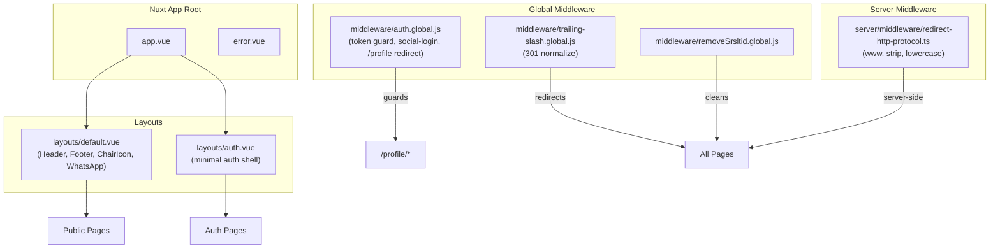
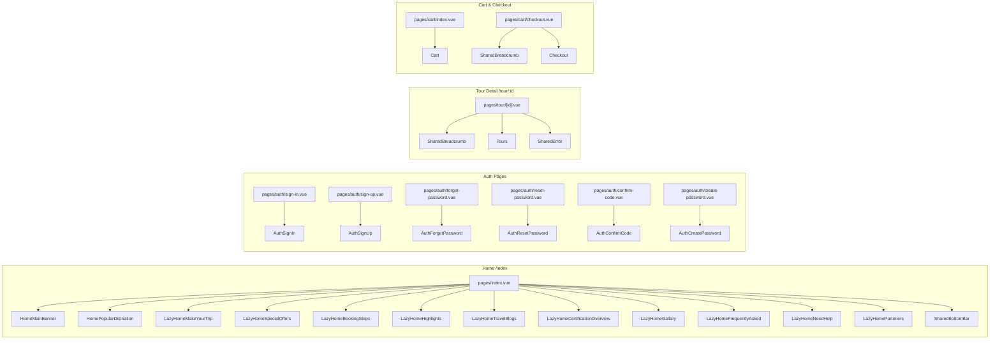
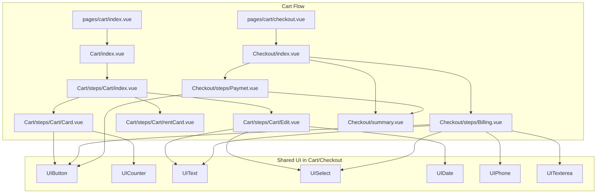
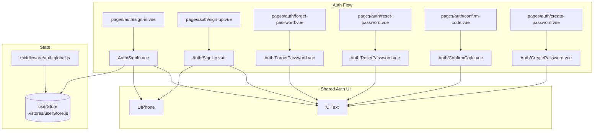
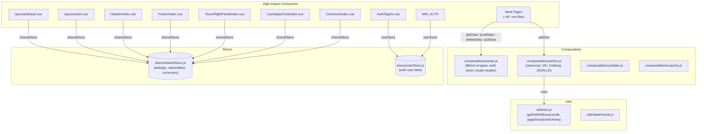
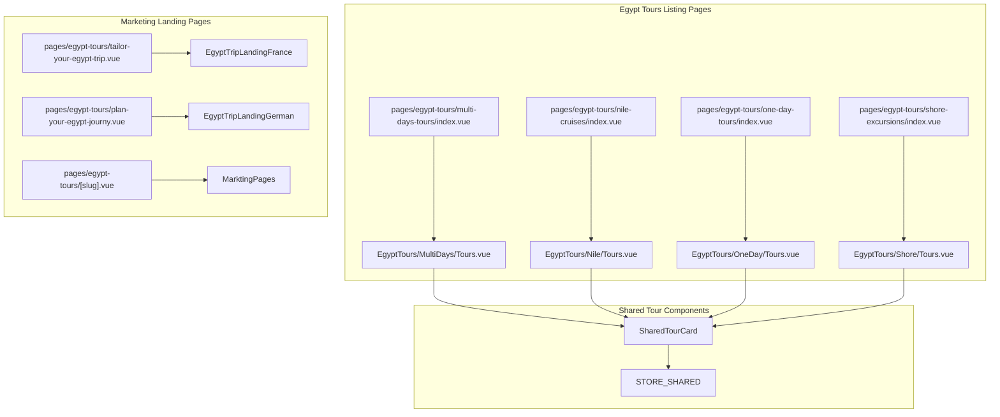
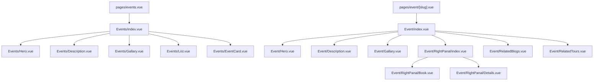

# Code Review Graph — Sun Pyramids Tours (sun-front)

> Generated: 2026-04-27
> Framework: Nuxt 3 (Vue 3, SSR)
> Purpose: AI-assisted code review dependency mapping

---

## 1. High-Level Architecture

---

## 2. Page → Section Component Mapping

---

## 3. Component Hierarchy — Cart / Checkout (Critical Path)

---

## 4. Component Hierarchy — Auth (Critical Path)

---

## 5. Composable & Store Dependency Graph

---

## 6. Feature Area — Egypt Tours

---

## 7. Feature Area — Blogs / Travel Guide

```mermaid
graph TD
  subgraph "Blog Pages"
    P_BLOGS["pages/blogs/all-blogs.vue"] --> C_BLOGS_CATS["Blogs/Categories/index.vue"]
    P_BLOGS --> C_BLOGS_MB["Blogs/Categories/MainBanner.vue"]
    P_BLOGS --> C_BLOGS_SEARCH["Blogs/Categories/SearchInput.vue"]
    P_BLOG["pages/blog/[slug].vue"] --> C_BLOG_BANNER["Blogs/Blog/MainBanner.vue"]
    P_BLOG --> C_BLOG_BODY["Blogs/Blog/index.vue"]
    P_BLOG --> C_BLOG_RELATED["Blogs/Blog/Related.vue"]
    P_BLOG --> TOURS_RELATED["Tours/LeftPanal/Related.vue"]
  end

  subgraph "Travel Guide Pages"
    P_GUIDE["pages/egypt-travel-guide/index.vue"] --> C_GUIDE_BANNER["Blogs/Categories/MainBanner.vue"]
    P_GUIDE --> C_GUIDE_CATS["Blogs/Categories/index.vue"]
    P_GUIDE_CATE["pages/egypt-travel-guide/[cate]/index.vue"] --> C_GUIDE_CATE_BANNER["Blogs/Category/MainBanners.vue"]
    P_GUIDE_CATE --> C_GUIDE_CATE_BLOGS["Blogs/Category/Blogs.vue"]
    P_GUIDE_ID["pages/egypt-travel-guide/[cate]/[id].vue"] --> C_GUIDE_ID_BANNER["Blogs/Category/MainBanners.vue"]
    P_GUIDE_ID --> C_GUIDE_ID_BLOGS["Blogs/Category/Blogs.vue"]
  end

  subgraph "Shared Blog UI"
    C_BLOGS_CATS --> SHARED_BLOG_CARD["SharedBlogCard"]
    C_GUIDE_CATE_BLOGS --> SHARED_BLOG_CARD
    C_BLOG_RELATED --> USE_API
    C_BLOG_BANNER --> USE_API
  end
```

---

## 8. Feature Area — Events

---

## 9. Impact Heatmap for Code Review

| File / Module | Consumers | Risk Level | Notes |
|---|---|---|---|
| `composables/useApi.js` | ~40 files | **HIGH** | Central HTTP client; changes affect every data fetch |
| `composables/useSeo.js` | ~25 files | **HIGH** | SEO composable; affects search visibility |
| `stores/sharedStore.js` | ~25 files | **HIGH** | Settings, currency, nationality; layout + many components |
| `stores/userStore.js` | ~5 files | **MEDIUM** | Auth state; middleware + auth components |
| `layouts/default.vue` | ~40 pages | **HIGH** | Global shell; Header/Footer injected here |
| `middleware/auth.global.js` | All routes | **MEDIUM** | Guards /profile; handles social login |
| `components/UI/*.vue` | ~50+ files | **HIGH** | Shared UI primitives; widespread blast radius |
| `components/Shared/TourCard.vue` | Many | **MEDIUM** | Core tour display card |
| `components/Shared/BlogCard.vue` | Many | **MEDIUM** | Core blog display card |
| `pages/index.vue` | Entry point | **HIGH** | Homepage; uses many Lazy-loaded components |
| `pages/cart/checkout.vue` | Conversion | **CRITICAL** | Payment/checkout flow |
| `pages/tour/[id].vue` | Core product | **HIGH** | Main tour detail page |

---

## 10. Review Checklist by Layer

### 10.1 Infrastructure Layer
- [ ] `nuxt.config.ts` — route rules, runtimeConfig, module order
- [ ] `tailwind.config.js` — theme tokens, content paths
- [ ] `server/middleware/redirect-http-protocol.ts` — redirect logic correctness
- [ ] `.github/workflows/main.yml` — **CRITICAL: hardcoded PAT present**

### 10.2 Global Layer
- [ ] `app.vue` — GTM/GA4 injection, `html lang` binding
- [ ] `layouts/default.vue` — global layout, store hydration
- [ ] `middleware/*.global.js` — auth guard, trailing slash, srsltid cleanup

### 10.3 Composables & Stores
- [ ] `composables/useApi.js` — auth header injection, error handling
- [ ] `composables/useSeo.js` — canonical logic, hreflang correctness
- [ ] `stores/sharedStore.js` — cookie-backed currency selection
- [ ] `stores/userStore.js` — token lifecycle

### 10.4 Shared Components (High Blast Radius)
- [ ] `components/UI/*.vue` — form inputs, buttons, icons
- [ ] `components/Shared/TourCard.vue` — pricing display, timer logic
- [ ] `components/Shared/BlogCard.vue` — image lazy-loading
- [ ] `components/Header/index.vue` — navigation, mobile menu, search
- [ ] `components/Footer/index.vue` — links, newsletter

### 10.5 Feature Components
- [ ] `components/Cart/**/*.vue` — cart mutations, rental vs. tour logic
- [ ] `components/Checkout/**/*.vue` — billing validation, payment flow
- [ ] `components/Tours/**/*.vue` — booking panel, calendar, add-ons
- [ ] `components/Auth/**/*.vue` — form validation, password rules

### 10.6 Pages
- [ ] `pages/index.vue` — Lazy component loading, above-the-fold ordering
- [ ] `pages/tour/[id].vue` — SEO, error state, data fetching
- [ ] `pages/cart/checkout.vue` — checkout conversion correctness
- [ ] `pages/profile/**/*.vue` — authenticated data handling

---

*End of Code Review Graph*
